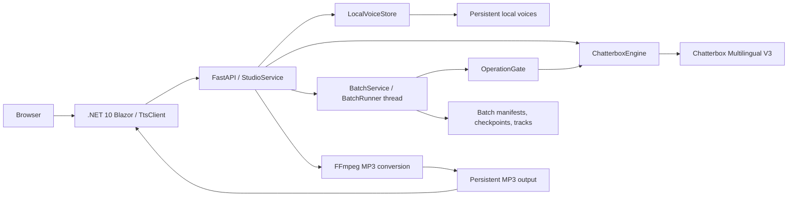

# PereneTTS

A small local voice studio: upload an MP3 or WAV recording to preserve a named voice, hear a predefined sample, then generate new speech in English, Portuguese, or Swedish. The frontend is a .NET 10 Blazor Interactive Server application; a separate Python/FastAPI worker runs Chatterbox Multilingual V3. Generated audio can be played and downloaded as MP3. A **Batch audio** page converts a folder of book `.txt` files into one MP3 per file with pause, resume, stop, and retry. The PereneArchive-style sidebar separates **Create a voice**, **Generate audio**, **Batch audio**, and **My creations**. Montserrat, Zilla Slab, and Bootstrap Icons are bundled locally; forest-green dark mode and cream light mode follow the Perene design guide.

## Start with Docker

Install Docker with Compose and GNU Make. On Windows use Docker Desktop's Linux containers and run Make from WSL2. On Steam Deck/Linux use Docker or a Docker-compatible Podman socket with Compose.

```sh
cd perene-tts
make docker-build
make docker-run-bg
```

Open **http://localhost:8082**. The first worker start downloads the pinned model into a persistent cache; the studio reports loading until the engine is ready. Allow several GB of disk space and RAM. CPU generation can take several minutes. This project does not need the .NET SDK or Python installed on the host for Docker mode.

Optionally copy `.env.example` to `.env` and change `WEB_PORT`. Both published ports are bound to localhost: the browser UI uses `WEB_PORT` (8082), and the worker health/API uses `TTS_PORT` (5081). Containers still communicate through `http://tts:5081`.

## Blazor watch mode

Like perene-archive, the default web container uses the .NET 10 SDK, mounts `WebApp/`, and runs `dotnet watch --non-interactive run --no-launch-profile --urls http://0.0.0.0:8080`. `make docker-run` attaches to Blazor and TTS logs; `make docker-run-bg` starts the same watcher in the background, with `make docker-logs` for output. On startup Blazor prints restore/build results, hot reload status, and `Now listening on: http://0.0.0.0:8080`. Open http://localhost:8082 on the host.

Polling detects edits through Docker mounts. Supported Razor/C#/CSS edits hot reload; edits requiring a restart are handled automatically without a console prompt. `bin`, `obj`, and NuGet packages use dedicated volumes so container builds stay out of the authored source tree. Web restore uses configurable `WEB_DNS_PRIMARY` and `WEB_DNS_SECONDARY` resolvers for the same Podman DNS issue described below. Watch guidance follows [Microsoft Learn](https://learn.microsoft.com/dotnet/core/tools/dotnet-watch).

Use `make dotnet ARGS="build"` for an explicit SDK build. `make test` runs the worker pytest suite, the `WebApp.Tests` xUnit project (Dockerfile `web-test` stage), and compiles the published .NET runtime target; `Dockerfile` retains a separate non-root `runtime` stage for publication validation. Development Compose deliberately uses the SDK watcher rather than that published stage. The Mac web container uses the same watch setup with the native TTS worker.

## Use the studio

1. Choose a voice name and recording language: English, Português, or Svenska.
2. Upload a spoken MP3 or WAV recording lasting **3–60 seconds**, no larger than **20 MiB**. A clear recording with one speaker works best. Click **Create voice & hear sample**.
3. Wait for the voice preparation and predefined preview; play it or download the MP3.
4. Open **Generate audio**, select a saved voice, enter up to **5,000 characters** in its language, and click **Generate audio**.
5. Open **My creations** to search and play/download saved audio, or switch to the **Voices** tab to reuse a voice. Completed audio remains listed after restarts. You can navigate between pages during generation.

The English voice test reads: “Hello! Welcome to PereneTTS. This is a quick voice test to hear how natural and clear my voice sounds.” Portuguese and Swedish use equivalent translations, shown before uploading.

Voices are local and shared across browsers using this instance. Uploading the same decoded recording in the same language reuses its voice ID and original name. Voices are bound to their selected language. Only one voice test or text generation runs at a time to prevent the model's mutable conditioning from crossing voices; a second one receives a busy message.

## Batch audio

Use **Batch audio** to turn a book export (for example the book-notes-ia `EbookParseService` output folder) into an audiobook-style set of MP3s:

1. Enter a batch name (1–80 characters, no `/`, `\`, or control characters) and choose a saved voice. Every file is read in that voice's language.
2. Click **Choose folder** (or multi-select files). Only `.txt` files are kept and other files are counted as skipped. A new selection replaces the list.
3. Check the narration order: names ending in `intro` first, then `chapter-NNN.txt` in numeric order, then other files in natural order, then names ending in `outro`. Move or remove rows; each row shows the output name `<Batch name> NNN.mp3`.
4. Click **Start batch**. Conversion runs inside the worker, so you can close the browser; reopen the page to see the current track, chunk, overall percent, elapsed synthesis time, and an estimate from the measured average chunk time. The sidebar shows “Batch · n/m tracks” while a batch is active.

Limits: 1–200 files, each valid UTF-8 (a leading BOM is ignored), 1–200,000 characters after trimming, at most 1 MiB, and at most 10 MiB per batch. The page pre-checks these and the worker rejects the whole batch with the file name and reason if any file is invalid.

- **Pause** finishes the current chunk (≤ 280 characters), saves it as a checkpoint, and releases the voice engine. **Resume** continues from the next unsynthesized chunk, even after a worker restart.
- **Stop** (after a confirmation) discards the current track's partial progress, keeps completed tracks, and never touches your original files. **Retry** on a failed or stopped batch regenerates only tracks whose MP3 is missing or fails its checksum; a failed track can also be retried alone.
- **Download all** returns `<Batch name>.zip` with every completed `<Batch name> NNN.mp3`. Each track also plays and downloads individually. **Delete** (not available while running) permanently removes the batch's uploaded text, checkpoints, and tracks.
- Batches run one at a time in creation order. While a batch runs, voice tests and text generation still start: they wait at most one chunk (“Waiting for the batch to reach a safe point”), run first, and the batch reloads its own voice afterwards.
- If the worker restarts, interrupted batches return to the queue and continue automatically once the model is ready, from their last checkpoint. Paused batches stay paused. Pause a batch if you want the CPU back.
- Completed tracks also appear in **My creations** with a “Batch · name · NNN/MMM” tag. Select the tag to show only that batch; clear the chip to return. Chapter text is not shown there.

Tracks are encoded at 192 kbps MP3, the same quality as single-text speech; resumed tracks use the same per-chunk seeds and silences as an uninterrupted run. Plan disk space for about 1.4 MB per minute of audio (a ~436,000-character book is roughly 8 hours, ~0.7 GB) plus one track's WAV checkpoints (~2.9 MB per minute).

Set `TTS_BATCH_ENABLED=false` (in `.env` for Docker, or the environment for `make mac-worker`) to turn the runner off: new batches are refused with 503, the page explains why, and existing batches stay listed and downloadable. Voice tests and generation are unaffected.

## Apple Silicon: use Metal

Docker's Linux containers cannot use Apple's Metal/MPS GPU through container GPU passthrough. For Apple GPU acceleration, run the TTS worker **natively on macOS** and keep Blazor in Docker. The pinned Chatterbox implementation loads non-CUDA checkpoints through CPU before moving the model to MPS. [Docker GPU documentation](https://docs.docker.com/desktop/features/gpu/), [Chatterbox source](https://github.com/resemble-ai/chatterbox/blob/5de7a54aa4e5e2baadb0182dde554908b48b85c2/src/chatterbox/mtl_tts.py)

Install Python 3.11 and FFmpeg (for example `brew install python@3.11 ffmpeg`), then:

```sh
make mac-setup
make mac-worker  # keep this terminal open
```

In another terminal:

```sh
make mac-up
```

Open the same localhost web URL. `TTS_DEVICE=auto` selects CUDA if available, otherwise MPS, otherwise CPU. The studio reports the selected device. Native macOS enables PyTorch's CPU fallback for unsupported MPS operations. You can require MPS with `TTS_DEVICE=mps make mac-worker`; this fails clearly if unavailable. This uses the available Apple GPU, but is not a claim of a measured optimal configuration or Neural Engine acceleration.

The native worker listens on port 5081 on the host so Docker Desktop can reach `host.docker.internal`. Use this mode on a trusted machine/network; there is no login on the worker. `TTS_HOST` can override the bind address when your network setup permits it. `make mac-down` stops the Mac web container; Ctrl+C stops the native worker.

Pure Docker mode (`make docker-run-bg`) uses CPU and does not force amd64 emulation on Apple Silicon. ARM64 and native MPS need target-device validation; only Linux x86-64 can be exercised on this development Steam Deck. Stop the regular Docker stack with `make docker-down` before switching modes because both web modes use the same port.

## Commands

| Command | Purpose |
| --- | --- |
| `make docker-build` | Build frontend/backend images. |
| `make docker-run` | Run Blazor watch mode in the foreground, with build/startup logs attached. |
| `make docker-run-bg` | Run the same watch mode in the background. |
| `make docker-down` | Stop the stack, preserving data/model volumes. |
| `make docker-logs` | Follow web/worker logs. |
| `make docker-ps` | Show container status. |
| `make test` | Run pytest in a lightweight model-free container, run the xUnit `WebApp.Tests` in the SDK image, then compile the web image. |
| `make docker-check` | Validate standard and Mac Compose configurations. |
| `make docker-reset` | Delete containers and all saved voices/audio/model/key volumes. |
| `make docker-shell` / `make docker-exec` | Open a new/running .NET SDK shell. |
| `make dotnet ARGS="build"` | Run a .NET CLI command in the SDK container. |
| `make get-url` | Print the published UI and worker health addresses. |
| `make mac-setup` | Create native macOS Python environment and install pinned dependencies. |
| `make mac-worker` | Run native worker with automatic device selection. |
| `make mac-up` / `make mac-down` | Start/stop Docker web host for the native worker. |

The original `build`, `up`, `down`, `logs`, `ps`, and `check` names remain aliases; canonical commands match perene-archive.

You can also run `docker compose up -d --build web tts` without Make. The .NET project can be built directly with `dotnet build WebApp/WebApp.csproj` when the .NET 10 SDK is installed.

## Persistence and lifecycle

Docker uses named volumes `perene-tts_tts-data`, `perene-tts_tts-models`, and `perene-tts_web-keys`, plus development `web-bin`, `web-obj`, and `web-nuget` volumes. The data volume contains `voices/<uuid>/reference.wav`, `conditioning.pt`, checksum/revision metadata, `name.json`, and `outputs/<job-uuid>.mp3` with a JSON sidecar containing the voice, language, text, type, and UTC creation time. Batches live in `batches/<batch-uuid>/`: an atomic `manifest.json` (states, checksums, timings), server-named `sources/NNN.txt` copies, published `tracks/NNN.mp3`, and `work/NNN/` chunk checkpoints for the track in progress. Uploaded file names are labels only and never used as paths. Deleting `batches/` removes all batch data without touching voices or other audio. Models are cached separately. Restarting containers, rebuilding images, or running `make docker-down` preserves these volumes. Removing volumes manually destroys their contents; there is no automatic audio retention/deletion policy. Back up the data volume for voices you want to keep.

Native macOS stores recordings/conditioning/audio in `services/ChatterboxTtsService/data` and models in `services/ChatterboxTtsService/models`; both are ignored by Git. `TTS_DATA_DIR` and `HF_HOME` can override these paths. Native and Docker stores are separate; switching modes does not automatically migrate voices.

Jobs run in one Python process. The latest 100 voice-test/speech job statuses are held in memory, and those in-flight jobs do not resume after a worker restart (batches do; see Batch audio). Completed MP3 URLs and voices remain on disk. Retry an interrupted operation; if conditioning was already saved, it will be reused. My creations lists completed audio from disk, including older MP3s without metadata. Earlier files appear as “Earlier creation” with their file timestamp; their original voice/text information cannot be recovered. Running job progress and text drafts are shared across pages within a browser session; refreshing the browser clears these transient values.

## Architecture



The service adapts `book-notes-ia/services/ChatterboxTtsService`'s engine, UUID voice store, reference/output validation, and chunking. It retains source revision `5de7a54aa4e5e2baadb0182dde554908b48b85c2` and model revision `5bb1f6ee58e50c3b8d408bc82a6d3740c2db6e18`. Saved conditioning is loaded with checksums, model/schema compatibility checks, and the upstream restricted `weights_only=True` loader. No conditioning-file upload is accepted. See [Chatterbox](https://github.com/resemble-ai/chatterbox) for upstream MIT licensing and model information. UI cards, responsive layout, and dark/paper-light appearance are inspired by `perene-archive`; neither reference project is modified.

The .NET host uses typed HttpClient and Interactive Server rendering per [Microsoft Learn render modes](https://learn.microsoft.com/aspnet/core/blazor/components/render-modes?view=aspnetcore-10.0). Upload streaming uses explicit bounds following [Microsoft Learn file uploads](https://learn.microsoft.com/aspnet/core/blazor/file-uploads?view=aspnetcore-10.0).

Worker routes: `GET /health`, `GET /voices`, `GET /creations`, `POST /voices` (multipart name/language/audio), `POST /speech` (voice_id/text), `GET /jobs/{uuid}`, `GET /audio/{uuid}`, and the batch routes `GET|POST /batches`, `GET|DELETE /batches/{uuid}`, `POST /batches/{uuid}/pause|resume|stop|retry`, `POST /batches/{uuid}/tracks/{n}/retry`, `GET /batches/{uuid}/tracks/{n}/audio`, `GET /batches/{uuid}/archive`. Audio is streamed through the web host at `/audio/{uuid}`, `/batches/{uuid}/tracks/{n}`, and `/batches/{uuid}/archive`; `?download=1` supplies the download disposition. The Docker worker API is published only on localhost; use http://localhost:5081/health or http://localhost:5081/docs. The worker root has no application screen. `0.0.0.0` in Uvicorn logs is a listening address, not the browser URL.

## Troubleshooting

A `Temporary failure in name resolution` during model loading means the container cannot resolve external model-download hosts. The TTS service now uses explicit DNS resolvers, defaulting to `1.1.1.1` and `8.8.8.8`. Set `TTS_DNS_PRIMARY` and `TTS_DNS_SECONDARY` in `.env` to reachable corporate/LAN DNS servers if required. Compose supports per-service DNS without replacing the internal service-name network. [Compose DNS documentation](https://docs.docker.com/reference/compose-file/services/#dns)

After updating configuration, run `make docker-run-bg` to recreate changed containers and preserve volumes. Check `make docker-logs`; downloading a model on a fresh cache still takes time. The worker automatically retries transient loading failures. Health is at http://localhost:5081/health and API documentation at http://localhost:5081/docs; the actual studio is http://localhost:8082.

The ASP.NET Data Protection “No XML encryptor configured” line is a warning about unencrypted local key storage, not the model startup failure. Keys already persist in their dedicated volume.

- **Loading or model error:** inspect `make docker-logs`. First start requires access to Hugging Face; cached weights are reused on subsequent starts. The worker retries failed model loads automatically after 15 seconds, then 30 seconds, then every 60 seconds until ready or stopped.
- **Busy:** wait for the active voice test or generation to finish before submitting another one. A running batch never causes this message.
- **Batch stays queued with “Waiting for the voice engine”:** the model is still loading; the batch starts automatically when it is ready.
- **Invalid recording:** choose a readable, non-silent MP3 or WAV with 3–60 seconds of speech.
- **Worker unavailable:** ensure the worker is running. In Mac mode start `make mac-worker` before `make mac-up`.
- **Docker socket access on Steam Deck:** ensure the current user can access the Docker/Podman socket.

This project deliberately has no database, authentication, combined single-file audiobook output, GPU container configuration, or public deployment setup. Hardware performance and speech quality need real-model tests on the intended machines.

Validation on Linux x86-64: both images build, 34 pytest tests pass, real English preview/custom-text synthesis succeeds, and Chromium verifies the Swedish upload/generation/download flow with a fake engine plus real FFmpeg. Desktop/mobile layouts were visually inspected. See the foundation Validation document for pending hardware and language-quality checks.

See [AGENTS.md](AGENTS.md) and the design documents under [Specs](Specs).

The shared circuit-scoped studio session and navigation follow [Microsoft Learn state management](https://learn.microsoft.com/aspnet/core/blazor/state-management/?view=aspnetcore-10.0) and [NavLink guidance](https://learn.microsoft.com/aspnet/core/blazor/fundamentals/navigation?view=aspnetcore-10.0). Locally bundled fonts use the SIL Open Font License and Bootstrap Icons uses MIT; license files are in `WebApp/wwwroot/vendor/`.
