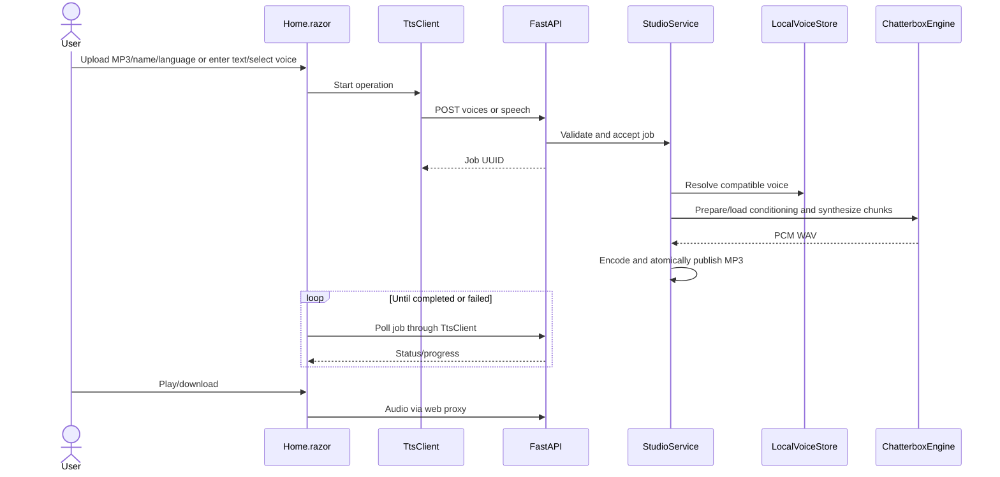

# Plan: Perene TTS Foundation

## Table of Contents
- [Summary](#summary)
- [Technical Approach](#technical-approach)
- [Component Breakdown](#component-breakdown)
- [Dependencies](#dependencies)
- [External / Vendor Documentation Evidence](#external--vendor-documentation-evidence)
- [Flow](#flow)
- [Risk Assessment](#risk-assessment)

## Summary
Implement FR1–FR10 as an independent .NET 10 Blazor Interactive Server host and a FastAPI Chatterbox worker. Reuse the actual `engine.py`, `voice_store.py`, `audio_validation.py`, and `chunking.py` from the existing service, extending language/device support without copying audiobook infrastructure.

## Technical Approach
Development runs the SDK watcher with mounted WebApp source and separate bin/obj/NuGet volumes, following the actual perene-archive Dockerfile/Compose pattern. Both standard and Mac Compose select the development stage; the runtime stage is still published during make test. Polling and non-interactive hot reload support mounted edits without prompts. The Blazor host uses DI and a typed TtsClient, following the ASP.NET/Blazor structure found in `perene-archive/WebApp/WebApp/Program.cs`. A single page owns form state; CSS uses responsive cards, subdued dark colors, and a paper-light theme inspired by perene-archive without importing its authentication/database stack. Labels, keyboard controls, live status announcements, disabled controls, empty voice lists, backend failures, and mobile stacking are explicit UI requirements.

The Python StudioService owns jobs, bounded MP3 decoding/encoding with FFmpeg, voice naming, and orchestration. LocalVoiceStore owns UUID paths and compatible checksum-validated conditioning. ChatterboxEngine owns model loading and synthesis. One nonblocking operation gate covers each accepted job, including conditioning and synthesis. Job polling avoids holding browser requests open during slow CPU inference. Audio is atomically published under job UUIDs and streamed through the web host; persisted audio remains available after restart. Model startup retries transient failures with interruptible 15/30/60-second backoff. Compose publishes the worker only on loopback and configures overridable TTS_DNS_PRIMARY/TTS_DNS_SECONDARY resolvers to avoid the reproduced Podman upstream-DNS failure. Canonical Make targets match perene-archive: docker-build, docker-run (foreground), docker-run-bg, docker-down, docker-logs, docker-ps, docker-test, docker-check; the initial short commands remain aliases. A bounded in-memory registry tracks the latest jobs; in-flight work does not resume after worker restart.

New names are proposed implementation paths, not existing source files. No additional database, UI package, or queue is needed: named Docker volumes and JSON sidecars satisfy local persistence. Tests follow the source service's pytest/fake-engine pattern and exercise real FFmpeg with generated audio. A separate lightweight test image excludes PyTorch/models. CPU containers do not force amd64 so Apple Silicon can run natively when dependency wheels support ARM64. A native macOS virtualenv provides MPS access that Linux Docker containers cannot offer.

## Component Breakdown
**Existing files to modify:** None; the destination is empty and both reference projects remain untouched.

**New files to create:**
- `WebApp/WebApp.csproj`, `WebApp/Program.cs` — .NET 10 Blazor host and audio proxy.
- `WebApp/Components/App.razor`, `Routes.razor`, `_Imports.razor`, `Pages/Home.razor`, `Layout/MainLayout.razor` — shell, routing, forms, progress, player.
- `WebApp/Services/TtsClient.cs`, `WebApp/Models/Contracts.cs` — typed worker communication and wire models.
- `WebApp/wwwroot/app.css` — authored responsive dark/light stylesheet.
- `services/ChatterboxTtsService/app/{engine,voice_store,audio_validation,chunking}.py` — copies of source components with scoped Swedish/device extensions.
- `services/ChatterboxTtsService/app/{studio,main}.py` — focused job orchestration and HTTP API.
- `services/ChatterboxTtsService/tests/` — fake-engine service/API tests and inherited core tests.
- `Dockerfile`, `docker-compose.yml`, `docker-compose.mac.yml`, `Makefile`, `scripts/mac-worker.sh` — portable container workflow and native MPS option.
- `.env.example`, `.gitignore`, `.dockerignore`, `README.md`, `AGENTS.md` — configuration and contributor context.

## Dependencies
.NET 10 SDK/runtime containers; Python 3.11; pinned Chatterbox source and Multilingual V3 model; PyTorch 2.6; FFmpeg; FastAPI/Uvicorn; model-download network access on first start. Native macOS needs Python 3.11, FFmpeg, and Docker Desktop. Windows Make commands run through WSL2 or an environment with GNU Make.

## External / Vendor Documentation Evidence
- [dotnet watch](https://learn.microsoft.com/dotnet/core/tools/dotnet-watch): Microsoft Learn MCP confirms polling for Docker-mounted files, supported-edit hot reload, and non-interactive restart behavior for unsupported edits.
- [Blazor render modes](https://learn.microsoft.com/aspnet/core/blazor/components/render-modes?view=aspnetcore-10.0): Microsoft Learn MCP search confirms AddInteractiveServerComponents and AddInteractiveServerRenderMode configure Interactive Server (FR1).
- [Blazor static assets](https://learn.microsoft.com/aspnet/core/release-notes/aspnetcore-10.0?view=aspnetcore-10.0#blazor): Microsoft Learn MCP search confirms .NET 10 serves its script as a static web asset. `RequiresAspNetWebAssets=true` includes it during Docker project-only restore; `MapStaticAssets`, `Assets`, and `ImportMap` publish and route the framework/client resources.
- [Blazor file uploads](https://learn.microsoft.com/aspnet/core/blazor/file-uploads?view=aspnetcore-10.0): Microsoft Learn MCP search supports InputFile/OpenReadStream with explicit size bounds and server-generated storage names (FR2).
- [Compose service DNS](https://docs.docker.com/reference/compose-file/services/#dns): official Docker documentation supports custom per-service resolvers. On the current Podman network, explicit 1.1.1.1/8.8.8.8 resolved huggingface.co and reached HTTPS successfully while the default resolver failed.
- [Docker GPU support](https://docs.docker.com/desktop/features/gpu/): container GPU passthrough in Docker Desktop requires Windows WSL2/NVIDIA; native macOS inference is necessary for MPS (FR9).
- [Chatterbox](https://github.com/resemble-ai/chatterbox): official examples allow CPU/CUDA/MPS and list English, Portuguese, Swedish. Preserve source revision `5de7a54aa4e5e2baadb0182dde554908b48b85c2` and model revision `5bb1f6ee58e50c3b8d408bc82a6d3740c2db6e18` from the reference project.

## Flow

## Risk Assessment
| Risk | Evidence | Mitigation |
| --- | --- | --- |
| Slow CPU inference / large model | Source reports multi-minute previews and high RAM | Short preview text, job polling, persistent model cache, single inference |
| Cross-voice conditioning | Source model.conds is mutable | Serialize entire conditioning/synthesis operation |
| macOS containers cannot use Metal | Docker GPU passthrough limitation | Explicit native worker mode; do not claim Docker MPS |
| ARM64 dependency availability | Source lock targets Linux x86-64 | Resolve portable pins without CPU-wheel suffix; document hardware validation pending |
| Interrupted jobs | In-memory worker lifecycle | Permanent voice/audio storage; report unknown jobs after restart; retry |

## Perene Design and Library Follow-up
- Apply the sibling `design-guide-en.html` dark/light palette, Montserrat body font, Zilla Slab headings, and PereneArchive sidebar shell. Bundle font/icon assets and licenses locally.
- Split Create a voice, Generate audio, and My creations into routed Razor pages. Keep worker readiness, job progress, selected voice, and text draft in a circuit-scoped StudioSession; unsubscribe component events on disposal. Use NavLink active styles following Microsoft Learn navigation/state-management guidance.
- Atomically publish JSON metadata before the final MP3. Read persisted artifacts through GET /creations; tolerate missing/corrupt sidecars for older audio. List newest first and expose voice/name/language/text/time/type, never paths.
- Use the exact requested English preview and equivalent localized pt/sv messages; show preview text before submission. Verify history restart/failure/legacy behavior with real FFmpeg and fake inference, then exercise the routed UI with Chromium at desktop/mobile sizes.
