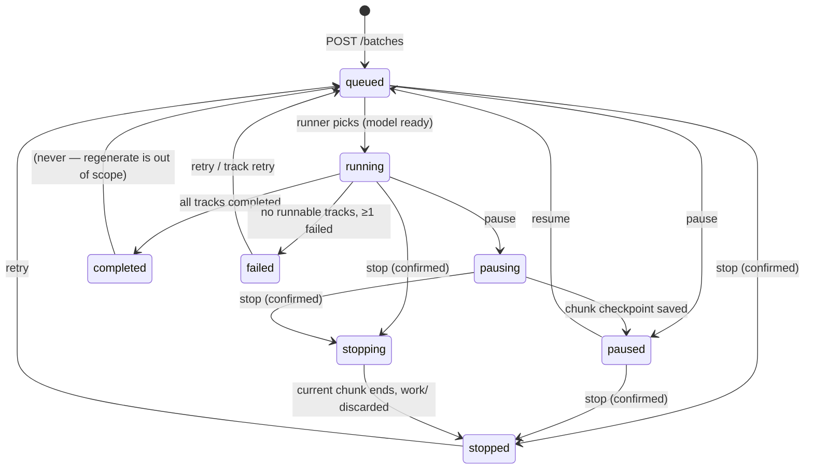
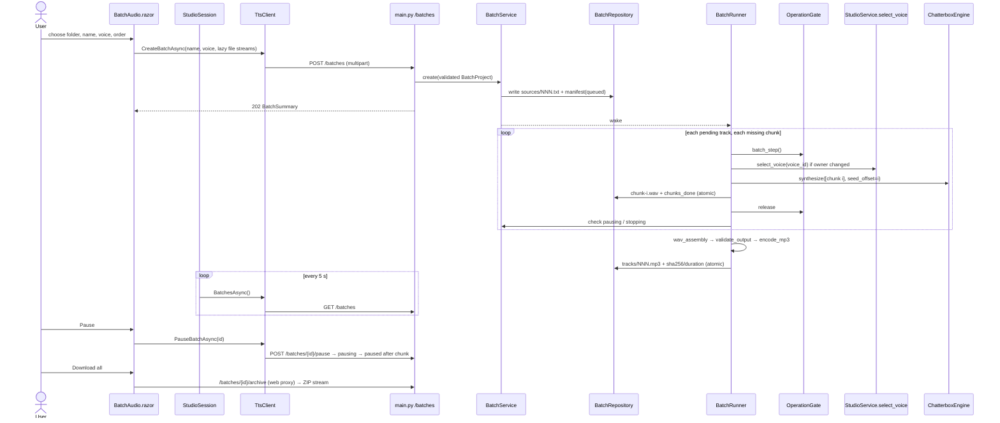

# Plan: Batch Text-to-Audio Jobs

## Table of Contents
- [Summary](#summary)
- [Technical Approach](#technical-approach)
  - [Where the job lives](#where-the-job-lives)
  - [Storage layout and manifest](#storage-layout-and-manifest)
  - [Batch and track state machine](#batch-and-track-state-machine)
  - [Runner, chunk checkpoints, and pause semantics](#runner-chunk-checkpoints-and-pause-semantics)
  - [Sharing the model with interactive operations](#sharing-the-model-with-interactive-operations)
  - [Engine change](#engine-change)
  - [Worker HTTP API](#worker-http-api)
  - [Web: client, session, routes](#web-client-session-routes)
  - [Web: Batch audio page](#web-batch-audio-page)
  - [My creations integration](#my-creations-integration)
  - [.NET test project](#net-test-project)
  - [Design principles applied](#design-principles-applied)
- [Component Breakdown](#component-breakdown)
- [Dependencies](#dependencies)
- [External / Vendor Documentation Evidence](#external--vendor-documentation-evidence)
- [Flow](#flow)
- [Risk Assessment](#risk-assessment)
- [Implementation Notes](#implementation-notes)

## Summary
Add a durable, pausable batch job to the Python worker. The batch converts an ordered set of uploaded `.txt` files into one MP3 per file. Persistence follows the book-notes-ia audiobook manifest/track design, and the lifecycle and controls follow perene-archive's job architecture: Pause/Resume/Stop/Retry, a confirmation modal, and one-line job rows. A new Blazor `Batch audio` page drives it through `TtsClient`.

## Technical Approach

### Where the job lives
perene-archive runs its jobs in a .NET `BackgroundService` because .NET owns its FFmpeg processes. In Perene TTS, the Python worker owns the model, the conditioning state (`model.conds`), and the process gate (AGENTS.md: "A process-level gate serializes accepted operations… run exactly one Uvicorn worker").

The batch runner therefore lives in the worker as one daemon thread, started from the FastAPI `lifespan` in `app/main.py` next to the existing `load_model_with_retry` thread. The web stays a thin client, with typed calls in `TtsClient` and polling in the circuit-scoped `StudioSession`.

We keep the archive's job concepts, not its hosting: states, guarded transitions, the "paused job keeps its place" rule, the Retry-resets-same-job rule, the confirmation modal, and the row/rules presentation. This deliberately departs from the archive's .NET hosting, because moving inference orchestration to .NET would break the documented single-process model lock.

### Storage layout and manifest
All batch files are server-generated under the existing `tts-data` volume (`TTS_DATA_DIR`, `/data` in Docker; the native Mac worker uses its own ignored data directory):

```text
/data/batches/<batch-uuid>/
├── manifest.json            # atomic, schema-validated (BatchManifest)
├── sources/001.txt …        # server-named UTF-8 copies of uploads (read-only after create)
├── tracks/001.mp3 …         # published outputs; downloaded as "<Batch name> 001.mp3"
└── work/<NNN>/              # checkpoints for the current track only
    ├── chunk-00000.wav
    └── checkpoint.json      # compatibility identity: voice, language, seed, revisions, chunk count
```

`app/batch_manifest.py` mirrors book-notes-ia `audiobook_manifest.py`. It defines frozen dataclasses `BatchManifest` and `BatchTrack`, a strict `from_path` with an exact field-set check plus `validate()`, and `BatchRepository` with these methods:
- `save`: `mkstemp` + `fsync` + re-parse + `os.replace`
- `load`, `list_summaries`, `delete`
- path containment (`resolve().parent` checks), the same as `LocalVoiceStore`.

Manifest fields:
- **Batch:** `schema_version`, `batch_id`, `name`, `voice_id`, `voice_name`, `language_id`, `model_revision`, `source_revision`, `conditioning_format_version`, `synthesis_seed` (1234, as in `_render`), `state`, `message`, `created_at`, `updated_at`, `chunk_seconds_total`, `chunks_done_total`.
- **Track:** `number`, `display_name` (sanitized client basename, label only), `source_sha256`, `chunk_count`, `chunks_done`, `state`, `error`, `output_sha256`, `duration_seconds`, `completed_at` (UTC ISO-8601; used as the My creations `created_at`).

`app/batch_project.py` mirrors book-notes-ia `audiobook_project.py` but takes uploaded bytes instead of a mounted folder. It handles:
- validating the name, file count, per-file and total size, and UTF-8/BOM/empty checks (limits from FR5)
- sanitizing display names
- computing `chunk_text(text, 280)` counts up front (so progress has a denominator)
- building `<name> NNN.mp3` output names.

Ordering is the client's submitted order. The worker does not reorder, because the user may have adjusted it.

### Batch and track state machine


Track states are `pending`, `running`, `completed`, and `failed`. The owner of all transitions is `BatchService` (`app/batch_service.py`). It holds a `threading.Lock` around each manifest read-modify-write and exposes guarded methods (`pause`, `resume`, `stop`, `retry`, `retry_track`, `delete`) that raise `InvalidTransition` (mapped to `409`). The runner checks the stored state after each chunk and never overwrites `pausing`, `paused`, `stopping`, or `stopped` with a late progress write. This is the archive's "late callback cannot overwrite Paused/Stopped" race rule (archive FR9).

Startup recovery is `BatchService.recover()`, called once from `lifespan`. It maps:
- `running`, `pausing` → `queued`
- `stopping` → `stopped`
- a `running` track → `pending` (with its checkpoints kept for resume)

### Runner, chunk checkpoints, and pause semantics
`BatchRunner` (`app/batch_runner.py`) runs a loop. It waits on a `threading.Event` that is set by create, resume, retry, model-ready, and stop.
1. Pick the oldest `queued` batch. If `engine.ready` is false, stay `queued` with the message "Waiting for the voice engine".
2. Mark it `running`. For each non-completed track in order:
   - Verify `sha256(sources/NNN.txt) == source_sha256` (book-notes-ia `_generate_track` rule) and re-chunk the text.
   - Read `work/NNN/checkpoint.json`. If its identity matches the batch (voice, language, seed, model/source revision, conditioning format, chunk count), keep `chunk-*.wav` files that pass `pcm_wav_metrics`. Otherwise clear `work/NNN/`.
   - For each missing chunk *i*: inside `gate.batch_step()`, ensure the batch voice's conditioning is selected, then call `engine.synthesize([chunk_i], tmp, language, 180, 420, seed, seed_offset=i)`. Validate the result and `os.replace` it to `chunk-{i:05d}.wav`. Then update `chunks_done` and the timing totals in the manifest. After the gate is released, check the requested state: `pausing` → `paused` (return), `stopping` → clear `work/NNN/`, `stopped` (return).
   - Assemble the track with `app/wav_assembly.py`. It appends each chunk's PCM frames with the stdlib `wave` module, followed by `paragraph_silence_ms` (420) zero frames when `chunk.paragraph_break_after` is set, otherwise `sentence_silence_ms` (180), and nothing after the last chunk. This is identical to the silence logic in `ChatterboxEngine.synthesize`.
   - Run `validate_output` and encode with the shared `encode_mp3` (extracted from `StudioService._render`, same `libmp3lame 192k` args). 192 kbps is a deliberate quality decision: the book-notes-ia POC produced lossless WAV, and batch output must not sound worse than single-text speech. Publish with `os.replace` to `tracks/NNN.mp3`, record the SHA-256 and duration, and clear `work/NNN/`.
   - A track exception marks the track `failed`. A `ValueError` message is kept; any other error gets "Audio generation failed. Check worker logs and retry.", following the `StudioService._run` convention. Processing continues with the next track.
3. Finalize the batch as `completed` or `failed` (FR12).

Pause is **cooperative at chunk boundaries**, not a process signal (archive used `SIGSTOP`/`SIGCONT` on an FFmpeg child). Inference runs on a thread inside the worker process, and suspending it would also freeze the HTTP server. The trade-off is pause latency of up to one chunk, and in exchange a pause survives restarts. Pausing releases the gate, which is better for a multi-hour book than the archive's "paused job occupies the worker".

Retry calls `track_can_be_skipped` semantics from book-notes-ia: a completed track is kept only if `tracks/NNN.mp3` exists and matches `output_sha256`. Otherwise it is reset to `pending`.

### Sharing the model with interactive operations
`app/operation_gate.py` adds `OperationGate`, which replaces `StudioService._gate`. It has two parts:
- `interactive()`: a non-blocking slot for at most one interactive op (raises the existing `BusyError` when taken). It sets `interactive_waiting` and then blocks on the model lock.
- `batch_step()`: waits while `interactive_waiting` is set, then acquires the model lock for exactly one chunk.

It also records `conditioning_owner` (the voice ID last loaded), so the runner re-runs voice selection only when an interactive op changed it.

`StudioService._start` moves model-lock acquisition into the job thread, so the HTTP request returns `202` immediately. Its job shows "Waiting for the batch to reach a safe point" until the lock is acquired. `_load`/`store.resolve` voice selection is exposed as `StudioService.select_voice(voice_id)` for reuse by the runner, so conditioning compatibility/checksum logic stays in one place.

### Engine change
Add a keyword-only `seed_offset: int = 0` to `SynthesisEngine.synthesize` and `ChatterboxEngine.synthesize`, making the per-chunk seed `synthesis_seed + seed_offset + index`. The default keeps current behavior exactly. Single-chunk calls with `seed_offset=i` reproduce what a whole-text call would have used for chunk *i*. Pinned model/source revisions are unchanged. `VoiceCompatibility` format version stays `2`, because conditioning files are unaffected.

### Worker HTTP API
In `app/main.py`:
- `POST /batches` is a multipart route (`name`, `voice_id`, repeated `files`). Each part is streamed in 64 KiB blocks into a temp directory under `/data/uploads`, with per-file (1 MiB) and total (10 MiB) caps. `RequestSizeLimit` gains a `/batches` limit of 10 MiB + 256 KiB. The rest go to `BatchService` (JSON):
  - `GET /batches`: summaries
  - `GET /batches/{id}`: detail with tracks
  - `POST /batches/{id}/pause|resume|stop|retry`
  - `POST /batches/{id}/tracks/{number}/retry`
  - `DELETE /batches/{id}`
- `GET /batches/{id}/tracks/{number}/audio` → `FileResponse(media_type="audio/mpeg", filename="<name> NNN.mp3")`.
- `GET /batches/{id}/archive` → `StreamingResponse` of a `zipfile.ZipFile` (`ZIP_STORED`; MP3 is already compressed) written to a non-seekable generator sink, using `filename="<name>.zip"`.
- A new `InvalidTransition` handler returns `409`. `TTS_BATCH_ENABLED=false` skips starting the runner and makes `POST /batches` raise a `SynthesisError`-style `503`.

### Web: client, session, routes
- `WebApp/Models/Contracts.cs` adds `BatchSummary`, `BatchDetail`, and `BatchTrack` records with explicit `JsonPropertyName` snake_case attributes, plus `BatchUpload(string Name, Stream Content)`.
- `WebApp/Services/TtsClient.cs` adds:
  - `BatchesAsync`, `BatchAsync`, `CreateBatchAsync(name, voiceId, IReadOnlyList<BatchUpload>)`
  - `PauseBatchAsync`, `ResumeBatchAsync`, `StopBatchAsync`, `RetryBatchAsync`, `RetryTrackAsync`, `DeleteBatchAsync`
  - `OpenBatchTrackAsync`, `OpenBatchArchiveAsync`

  Error `detail` extraction reuses the existing `ReadJobAsync` pattern, generalized to `ReadAsync<T>`.
- `WebApp/Services/StudioSession.cs` adds `Batches` (summaries) to `Refresh()` and a computed `ActiveBatch` for the sidebar line. Control methods call `TtsClient` and refresh. No conversion state lives in the circuit.
- `WebApp/Program.cs` maps `/batches/{id:guid}/tracks/{number:int}` and `/batches/{id:guid}/archive`. They are proxies that reuse the `/audio/{id:guid}` streaming handler (extracted into a local helper), use `HttpCompletionOption.ResponseHeadersRead`, and copy the worker's `Content-Disposition` when `?download=1`. Range/`Cache-Control: no-store` behavior is unchanged.

### Web: Batch audio page
`BatchAudio.razor` (`@inherits StudioComponent`) has a two-card workspace above a batch list, in the same structure as `GenerateAudio.razor` and `Creations.razor`.

- **New batch card**:
  - name input with a counter (`/ 80`) and a saved-voice `<select>` (with the empty-voice hint linking to `/`)
  - two pickers: `InputFile multiple accept=".txt,text/plain"` and a folder `InputFile` with `webkitdirectory`
  - an ordered `<ol>` of files with position, display name, output name, a character count, and icon buttons (Move up, Move down, Remove, each with an `aria-label`)
  - totals, inline validation messages, and a primary "Start batch" button that is disabled until valid and the engine is ready

  Files are forwarded using the Learn-recommended lazy per-file stream (`OpenReadStream(maxAllowedSize: 1 MiB)` opened only when `HttpClient` reads that part), never buffered whole.
- **Batch list**: a `job-list` of `BatchRow.razor` lines, following perene-archive `JobRow.razor`. Each line has a type icon, state badge (paused uses a static cue; active states animate), name, a progress bar with `role="progressbar"` and `n/m tracks · x%`, the current track and chunk, and an estimate. Icon actions (40px) are Pause/Resume, Stop, Retry, Delete, Download all, and a details toggle. Details list the tracks with `AudioPlayer` (`Preload="none"`), Download, and per-track Retry. Paging reuses `Creations.razor`'s pager and page sizes (5/10/25/50).
- **Modals**: Stop and Delete confirmations are component-local dialogs with focus placed on Cancel. Escape/Cancel sends no request.
- **Rules**: `WebApp/Models/BatchRules.cs` is a pure static class, the analog of the archive `JobListRules`. It holds `DefaultOrder(names)`, `OutputName(name, n)`, `CanPause/CanResume/CanStop/CanRetry/CanDelete(state)`, `BadgeClass(state)`, `Percent`, and `Remaining`. Razor stays declarative.
- **States**: empty "No batches yet", a loading skeleton until the first refresh, the worker-unavailable alert via the existing `Studio.Error`, and `TTS_BATCH_ENABLED=false` shown as a disabled card with an explanation.
- **Responsive**: the file list and rows collapse to stacked layout under the existing `@media` breakpoints used by `.job-row`.

### My creations integration
- **Worker:** `BatchService.creations()` reads each manifest once and yields one entry per `completed` track. The entry contains:
  - `kind: "batch"` and `job_id: "<batch-uuid>-<NNN>"`
  - `voice_id`, `voice_name`, `language_id`
  - `text: ""` (chapter text is never returned, which keeps the 5 s poll payload small)
  - `created_at` taken from `completed_at`
  - `batch_id`, `batch_name`, `track_number`, `track_count`, `source_name`.

  The `/creations` route in `app/main.py` concatenates `studio.creations()` and `batches.creations()` and sorts newest first. `StudioService.creations()` itself is unchanged, so legacy and preview/speech sidecars keep their behavior. Existing entries gain the new keys as `null`, so the wire shape stays uniform.
- **Contracts:** `Creation` in `WebApp/Models/Contracts.cs` gains nullable `BatchId`, `BatchName`, `TrackNumber`, `TrackCount`, and `SourceName` (snake_case `JsonPropertyName`). Older workers without these keys still deserialize.
- **Page:** `Creations.razor` uses `BatchRules.AudioUrl(creation)` (`/batches/{batchId}/tracks/{n}` for batch rows, `/audio/{jobId}` otherwise) for `AudioPlayer` and Download.
  - The job-type cell shows `bi-files` "Batch track". A tag button reads "Batch · `<name>` · 003/018" and sets a component-local `batchFilter`. A removable chip ("Showing batch `<name>` ×") clears it, and page number resets to 1, as with search.
  - The details `<dl>` shows Source file, Batch, and an "Open batch" link to `/batch-audio?batch=<id>`. `BatchAudio.razor` reads the query with `[SupplyParameterFromQuery]` and expands that batch.
  - `Matches` includes batch and source names.
  - Filter and URL logic live in `BatchRules` (`MatchesBatch`, `AudioUrl`, `TagLabel`), so they are unit-tested.
- **Lifecycle:** deleting a batch removes its directory, so its rows disappear on the next refresh. A retried track is `pending`, so it is hidden until it completes again.

### .NET test project
Add `WebApp.Tests/WebApp.Tests.csproj` (net10.0, `IsPackable=false`, `<Using Include="Xunit" />`) at the repo root with a `ProjectReference` to `../WebApp/WebApp.csproj`. It mirrors perene-archive's `WebApp.Tests` package set: `Microsoft.NET.Test.Sdk` 17.14.1, `xunit` 2.9.3, `xunit.runner.visualstudio` 3.1.4. Coverlet and `Mvc.Testing` are omitted because nothing here needs them.

Tests:
- `BatchRulesTests` (Theory-driven):
  - the example folder's order
  - case-insensitive intro/outro
  - natural sorting of `chapter-2` versus `chapter-10`
  - output names
  - each `Can*` across all states
  - percent and remaining time
  - `MatchesBatch` and `AudioUrl`.
- `TtsClientBatchTests`: a fake `HttpMessageHandler` asserts the request paths, the multipart field names and part order, and that a `{"detail": …}` error body surfaces as `InvalidOperationException`.

The Dockerfile gains a `web-test` stage: it restores both csproj files, copies `WebApp/` and `WebApp.Tests/`, and runs `dotnet test WebApp.Tests/WebApp.Tests.csproj --no-restore`. `make docker-test` runs `docker build --target web-test .` between the pytest container and the existing runtime-stage compile, so `make test` stays Docker-only.

`RequiresAspNetWebAssets=true` in `WebApp.csproj` already covers restoring before Razor files are copied. No solution file is required. If one is added for IDEs, it is `PereneTts.slnx`, following perene-archive.

### Design principles applied
- **Single responsibility:**
  - `batch_project` validates inputs
  - `batch_manifest` owns the schema and atomic persistence
  - `batch_service` owns transitions
  - `batch_runner` owns sequencing
  - `wav_assembly` owns PCM concatenation
  - `operation_gate` owns model exclusivity
  - `StudioService` keeps interactive jobs and voice selection.
- **Dependency inversion:** the runner depends on the `SynthesisEngine` protocol, a `select_voice` callable, an `encode_mp3` callable, and `OperationGate`, so the tests can use `FakeEngine` and real FFmpeg.
- **Reuse:** `chunk_text`, `validate_output`, `pcm_wav_metrics`, `ffmpeg`, `canonical_id`, `LocalVoiceStore`, the `/audio` proxy pattern, `AudioPlayer`, the `job-list` CSS, and the pager.
- **No new runtime packages:** the worker uses stdlib `wave`, `zipfile`, `hashlib`, and `threading`; the web uses existing ASP.NET Core and `InputFile`. No database, queue, or frontend library is introduced, because the manifest-on-disk pattern is already proven in book-notes-ia and matches this repo's "no database" constraint.
- **Test-only packages:** xUnit packages enter only `WebApp.Tests` (user-approved, FR23) and never the published runtime image.

## Component Breakdown

**Existing files to modify:**
- `services/ChatterboxTtsService/app/engine.py`: add the `seed_offset` keyword to the protocol and implementation.
- `services/ChatterboxTtsService/app/studio.py`:
  - use `OperationGate`
  - move lock acquisition into the job thread with a waiting message
  - extract `encode_mp3` and `select_voice`
  - keep the existing routes' behavior.
- `services/ChatterboxTtsService/app/main.py`:
  - batch routes and the `/batches` size limit in `RequestSizeLimit`
  - the `InvalidTransition` handler
  - runner start/stop and `BatchService.recover()` in `lifespan`
  - the `TTS_BATCH_ENABLED` flag.
- `services/ChatterboxTtsService/tests/test_studio.py`: let `FakeEngine.synthesize` accept `seed_offset` and record offsets, and adapt busy tests to the waiting-job behavior.
- `WebApp/Models/Contracts.cs`: batch wire records.
- `WebApp/Services/TtsClient.cs`: batch calls and the generic error reader.
- `WebApp/Services/StudioSession.cs`: `Batches`, `ActiveBatch`, control wrappers.
- `WebApp/Program.cs`: track/archive proxy routes and the shared streaming helper.
- `WebApp/Components/Layout/MainLayout.razor`: "Batch audio" nav link (`bi-files`) and the active-batch status line.
- `WebApp/Components/Pages/Creations.razor`: batch-track rows, tag, batch filter chip, details, and batch audio URLs (FR22).
- `services/ChatterboxTtsService/tests/test_studio.py` (creations section): assert that `/creations` merges batch tracks with empty text.
- `Dockerfile`: new `web-test` stage (FR23).
- `Makefile`: `docker-test` also builds the `web-test` target, and the help text mentions .NET tests.
- `WebApp/wwwroot/app.css`: file list, batch row, track list, modal, and progress styles with existing tokens and breakpoints.
- `docker-compose.yml`, `docker-compose.mac.yml`, `scripts/mac-worker.sh`: pass `TTS_BATCH_ENABLED` (default `true`).
- `README.md`, `AGENTS.md`: workflow, limits, storage, flag, architecture (after implementation, via `init-agent`).

**New files to create:**
- `services/ChatterboxTtsService/app/operation_gate.py`: interactive-priority model gate plus the conditioning owner.
- `services/ChatterboxTtsService/app/batch_project.py`: upload validation, display-name sanitizing, output naming, chunk counts.
- `services/ChatterboxTtsService/app/batch_manifest.py`: `BatchManifest`/`BatchTrack` schema and `BatchRepository`.
- `services/ChatterboxTtsService/app/batch_service.py`: guarded transitions, recovery, listing, delete.
- `services/ChatterboxTtsService/app/batch_runner.py`: background loop, checkpoints, assembly/publish orchestration.
- `services/ChatterboxTtsService/app/wav_assembly.py`: stdlib PCM concatenation with silences.
- `services/ChatterboxTtsService/tests/test_batch_project.py`, `test_batch_manifest.py`, `test_batch_runner.py`, `test_batch_api.py`, `test_operation_gate.py`, `test_wav_assembly.py`.
- `WebApp/Components/Pages/BatchAudio.razor`: page.
- `WebApp/Components/BatchRow.razor`: one batch line plus details.
- `WebApp/Components/ConfirmDialog.razor`: reusable accessible confirmation dialog for Stop and Delete.
- `WebApp/Models/BatchRules.cs`: pure ordering/action/presentation rules.
- `WebApp/Services/LazyBrowserFileStream.cs`: Learn's lazy `IBrowserFile` stream for multi-file forwarding.
- `WebApp.Tests/WebApp.Tests.csproj`, `WebApp.Tests/BatchRulesTests.cs`, `WebApp.Tests/TtsClientBatchTests.cs`: xUnit coverage of web rules and client (FR23).

## Dependencies
- The existing worker stack (`make docker-run-bg`), FFmpeg in the worker image, the `tts-data` named volume, and a loaded Chatterbox model for real runs. Tests need none of these beyond FFmpeg in the pytest container.
- At least one saved voice (created through the existing Create a voice page).
- Free disk space: about 1.4 MB of MP3 per minute of audio at 192 kbps (the ~436K-character example is roughly 8 hours, about 0.7 GB), plus at most one track's WAV checkpoints (about 2.9 MB per minute at 24 kHz/16-bit).
- No new environment variables beyond optional `TTS_BATCH_ENABLED`.

## External / Vendor Documentation Evidence
- [ASP.NET Core Blazor file uploads (.NET 10)](https://learn.microsoft.com/aspnet/core/blazor/file-uploads?view=aspnetcore-10.0). It supports these choices:
  - `InputFile` with `multiple` and `GetMultipleFiles(maximumFileCount)` to cap file count (cap: 200).
  - Selection is not cumulative, which is why a new pick replaces the list.
  - `OpenReadStream(maxAllowedSize)` with an explicit limit instead of the untrusted `IBrowserFile.Size` (1 MiB per file).
  - Avoid reading whole files into memory or strings on the server.
  - Never use client file names for storage. Razor encodes names for display, so the worker stores only `NNN.txt` and treats names as labels.
  - For Interactive Server components forwarding several files to another server, use `LazyBrowserFileStream` so each browser stream opens only when read.
  - The first SignalR message lists all selected files and can exceed `MaximumReceiveMessageSize` for very large selections. 200 short names stay well within the default, which is recorded as a risk.
- [IBrowserFile.OpenReadStream](https://learn.microsoft.com/dotnet/api/microsoft.aspnetcore.components.forms.ibrowserfile.openreadstream?view=aspnetcore-10.0): the default limit is 500 KB, and the method throws `IOException` when the file exceeds `maxAllowedSize`. `BatchAudio.razor` catches this as a per-file validation message.
- **Repo constraint versus archive/Learn hosted-service guidance:** perene-archive uses ASP.NET Core `BackgroundService` queues. This repo keeps orchestration in the single Python worker, because that process owns the model lock and conditioning state (AGENTS.md constraints). No .NET hosted service is added, so .NET background-service guidance does not drive this design.
- [Unit testing C# in .NET using dotnet test and xUnit](https://learn.microsoft.com/dotnet/core/testing/unit-testing-csharp-with-xunit): a separate xUnit test project with `Microsoft.NET.Test.Sdk`, `xunit`, and `xunit.runner.visualstudio`, a project reference to the code under test, `[Fact]`/`[Theory]` tests, and `dotnet test` building both projects and running the tests. This matches the planned `WebApp.Tests` and the Docker `web-test` stage. The template's `coverlet.collector` is optional and omitted.
- `webkitdirectory` is a browser attribute passed through `InputFile`'s additional attributes, not an ASP.NET API. Learn does not document it, so cross-browser folder picking is a manual verification item.

## Flow


## Risk Assessment

| Risk | Evidence | Mitigation |
| --- | --- | --- |
| An interactive voice test waits behind a long chunk | The gate is held for one chunk (≤ 280 chars). The book-notes-ia CPU POC already established that per-chunk synthesis time is acceptable on this hardware. | Interactive priority flag; waiting message in the job. |
| My creations rows break for older entries | `Creation` gains fields, and `/creations` merges two sources. | New fields are nullable, and legacy/preview/speech entries emit them as `null`. xUnit covers `AudioUrl` for both kinds, and pytest covers the merged response. |
| Docker `web-test` restore fails before sources are copied | `WebApp.csproj` already needs `RequiresAspNetWebAssets=true` for this ordering. | Restore both csproj files first, then copy sources (same pattern as the `build` stage). |
| Resumed tracks sound different from uninterrupted ones | `ChatterboxEngine.synthesize` seeds per chunk (`synthesis_seed + index`) and inserts silence between chunks. | `seed_offset` reproduces the seeds exactly, and `wav_assembly` reproduces the silence rule. A unit test compares the assembled output to a single fake multi-chunk call. |
| Manifest corruption on crash or power loss | Long-running CPU job on a handheld device. | Atomic `fsync` + replace + re-validate (book-notes-ia pattern); checkpoints validated on resume; worst case loses one chunk. |
| Late progress overwrites a user pause/stop | The runner and HTTP handlers mutate the same manifest from different threads. | All writes go through `BatchService` under one lock, and the runner re-reads state after each chunk. Tests cover pause/stop racing a completing chunk (archive FR9 equivalent). |
| Changing `_start` locking regresses existing flows | `test_studio.py` asserts busy/serialization behavior. | Keep `BusyError` for a second interactive op; update the tests deliberately; run the full suite through `make test`. |
| Large ZIP or track downloads time out through the web proxy | `TtsClient` timeout is 3 minutes; ~1 GB ZIP for a full book at 192 kbps. | Proxy with `ResponseHeadersRead` and stream the body. [HttpCompletionOption](https://learn.microsoft.com/dotnet/api/system.net.http.httpcompletionoption?view=net-10.0) confirms that with `ResponseHeadersRead` the `HttpClient.Timeout` applies only until headers arrive, so no separate client is needed. Verify a full-size ZIP manually. |
| Disk growth | Each book is roughly 0.5–1 GB of MP3 at 192 kbps (kept for quality). | Delete action and README guidance. Checkpoints exist for one track at a time. |
| Folder picker behaves differently across browsers | `webkitdirectory` is not standardized or Learn-documented; `IBrowserFile.Name` is the basename only. | Separate multi-file picker as a fallback; manual verification in Chromium and Firefox. |
| Auto-resume consumes CPU after an unexpected restart | `restart: unless-stopped` in `docker-compose.yml`. | Intended behavior (user-confirmed). Documented in the README; Pause persists across restarts for users who want the CPU back. |

## Implementation Notes
These decisions were made while implementing the plan and are reflected in the code:

- **Detail shape:** `GET /batches/{id}` returns `{"batch": <summary>, "tracks": [...]}`, so `BatchDetail` reuses `BatchSummary` without duplicated fields. Summaries add `tracks_completed`, `tracks_failed`, `chunk_count`, `chunks_done`, and `current_track_*` fields computed from the manifest.
- **Elapsed time** is `chunk_seconds_total`, the measured synthesis time, so it does not grow while a batch is paused or queued.
- **Failure messages:** only `TrackError` messages (source changed, chunk mismatch) are shown on a track. All other exceptions, including `ValueError`s from FFmpeg or reference validation that can contain paths, become "Audio generation failed. Check worker logs and retry." This is stricter than `StudioService._run`, to meet FR20.
- **Non-ASCII file names:** .NET `MultipartFormDataContent` sends them as RFC 2047 encoded-words, and python-multipart keeps that form. `sanitize_display_name` decodes it, and a pytest case posts a .NET-style body.
- **Encoder timeout:** `ffmpeg` gained a `timeout` argument. Batch tracks encode with 1,800 s instead of 120 s, because a long chapter can produce about 45 minutes of PCM. Settings are unchanged (`libmp3lame`, 192 kbps).
- **Health:** `GET /health` adds `batch_enabled`, which the page uses for the disabled state. `WorkerHealth.BatchEnabled` defaults to `true` for older workers.
- **Page pre-check:** the page reads each selected file once through `OpenReadStream(1 MiB)` to count trimmed characters and detect invalid UTF-8 (`BatchRules.MeasureTextAsync`). The worker still enforces every bound. Upload then uses `LazyBrowserFileStream`. The folder input accepts at most 1,000 selected entries before filtering to `.txt`.
- **Shared pager:** `Creations.razor`'s pager moved into `WebApp/Components/Pager.razor` so both pages reuse it. `StudioComponent.Dispose` became virtual so `BatchAudio.razor` can unsubscribe its own detail-refresh handler.
- **Mac Compose:** `docker-compose.mac.yml` defines only the web container, so `TTS_BATCH_ENABLED` is passed by `scripts/mac-worker.sh`, with `.env.example` documenting it. That file is unchanged.
- **Test fake:** `FakeEngine` moved from `test_studio.py` into `tests/conftest.py`, gaining `seed_offset`, `offsets`, `fail_when`, and `before` hooks shared by the batch tests.
